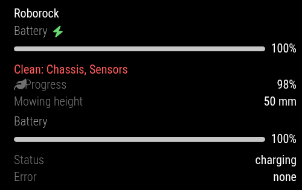
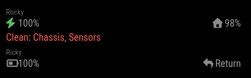

# MMM-Roborock

A MagicMirror² module that shows status for Roborock devices using the
`python-roborock` client.

The module was built for a mixed Roborock setup and supports both:

- Roborock robot vacuums exposed through `v1_properties.status`
- Roborock mower devices such as RockMow models that expose status through
  product schema fields

## Features

- Show one or more Roborock devices in the same module instance
- Compact display for mirrors with limited space
- `onlyActive` mode for showing only devices currently cleaning or mowing
- `onlyErrors` mode for showing only alerts
- Alerts are always shown, even in compact and active-only modes
- Uses Roborock device names from the API
- Supports MagicMirror's global language setting
- Includes translations for English, Danish, German, Dutch, and French
- Maintenance alerts for vacuum brush/filter parts at 0%
- Mower alerts for known conditions, including stuck and dirty LiDAR sensor

## Screens and Modes

### Full mode



### Compact mode



`mode` controls how much the module shows:

| Mode | Behavior |
| --- | --- |
| `full` | Detailed view for visible devices. |
| `compact` | Small two-column status line per device. |
| `onlyActive` | Compact view, only devices that are actively mowing/cleaning/returning. Alerts still show. |
| `onlyErrors` | Compact view, only devices with alerts/errors. |

## Requirements

- MagicMirror²
- Node.js supported by your MagicMirror version
- Python 3
- A Roborock account
- A Roborock device supported by `python-roborock`

The module creates a local Python virtual environment inside the module folder
by default. You can also manage the Python environment yourself and point
`pythonPath` at that interpreter.

## Installation

Clone the module into your MagicMirror `modules` directory:

```bash
cd ~/MagicMirror/modules
git clone https://github.com/YOUR_USERNAME/MMM-Roborock.git
cd MMM-Roborock
bash scripts/install_python_env.sh
```

The install script creates `venv/` and installs the Python dependencies from
`requirements.txt`.

## Roborock Login Setup

Run the setup script once:

```bash
cd ~/MagicMirror/modules/MMM-Roborock
./venv/bin/python scripts/setup_roborock.py --email your-roborock-email@example.com
```

The script will:

1. send a login code to your Roborock account email
2. ask for the code
3. store Roborock session data in `data/user_params.pkl`
4. list available devices with name, DUID, model, and category

Use the listed device names or DUIDs in your MagicMirror config.

## Configuration

Single-device example:

```js
{
  module: "MMM-Roborock",
  position: "bottom_left",
  config: {
    deviceName: "My Robot",
    preferCategory: "vacuum",
    mode: "compact",
    updateInterval: 5 * 60 * 1000
  }
}
```

Multi-device example:

```js
{
  module: "MMM-Roborock",
  position: "bottom_left",
  config: {
    mode: "onlyActive",
    showHeader: false,
    updateInterval: 5 * 60 * 1000,
    devices: [
      {
        id: "mower",
        type: "mower",
        deviceDuid: "YOUR_MOWER_DUID",
        preferCategory: "mower"
      },
      {
        id: "vacuum",
        type: "vacuum",
        deviceDuid: "YOUR_VACUUM_DUID",
        preferCategory: "vacuum"
      }
    ]
  }
}
```

## Options

| Option | Type | Default | Description |
| --- | --- | --- | --- |
| `pythonPath` | string | `"venv/bin/python"` | Python executable. Relative paths are resolved from the module directory. |
| `sessionDir` | string | `"data"` | Directory containing `user_params.pkl`. Relative paths are resolved from the module directory. |
| `deviceName` | string/null | `null` | Select a single device by exact or partial name. |
| `deviceDuid` | string/null | `null` | Select a single device by DUID. |
| `preferCategory` | string/null | `"mower"` | Preferred category when no name/DUID is set. Useful values include `mower` and `vacuum`. |
| `devices` | array/null | `undefined` | Optional list of device configs for multi-device display. Each item can use `id`, `type`, `label`, `deviceName`, `deviceDuid`, and `preferCategory`. |
| `updateInterval` | number | `300000` | Poll interval in milliseconds. Five minutes is recommended. |
| `retryDelay` | number | `60000` | Delay before retrying after an error. |
| `fetchTimeout` | number | `60000` | Maximum Python fetch time in milliseconds. |
| `mode` | string | `"full"` | One of `full`, `compact`, `onlyActive`, or `onlyErrors`. |
| `showHeader` | boolean | `true` | Show the Roborock module header. |
| `showConnection` | boolean | `false` | Show local/cloud/offline connection state in full mode. |
| `showUpdated` | boolean | `false` | Show last update time in full mode. |
| `showFirmware` | boolean | `false` | Show firmware version in full mode. |
| `showModel` | boolean | `false` | Show product model in full mode. |
| `showCategory` | boolean | `false` | Show product category in full mode. |
| `showRawStatus` | boolean | `false` | Show raw normalized status JSON in the UI. Do not enable on public screens. |
| `debug` | boolean | `false` | Write debug logs to `data/mmm-roborock-debug.log`. Logs can contain device IDs and local keys. |
| `labels` | object | `{}` | Optional label overrides. Translations are used by default. |

## Security Notes

Do not publish files from the local `data/` directory.

`data/user_params.pkl` contains Roborock login/session data. Debug logs may
contain device identifiers, status payloads, and local keys. The repository
`.gitignore` excludes these files, along with `venv/`, Python bytecode, and
local backup files.

Before publishing, run:

```bash
grep -RInE "local_key|user_params|token|password|deviceDuid|duid" . \
  --exclude-dir=.git --exclude-dir=venv --exclude-dir=data
```

Example configs in this README intentionally use placeholder DUIDs.

## Troubleshooting

### Missing login data

Run setup again:

```bash
./venv/bin/python scripts/setup_roborock.py --email your-roborock-email@example.com
```

### MQTT authorization errors

Some devices may fail live MQTT status refresh with an authorization error. The
module falls back to Roborock's schema status fields when available. For vacuum
devices this can still provide battery, state, errors, and maintenance data.

### Device not visible in `onlyActive`

`onlyActive` only shows devices that are actively mowing, cleaning, returning,
or have an alert. Try `mode: "compact"` or `mode: "full"` while debugging.

### Polling too often

Roborock can rate limit frequent API calls. Keep `updateInterval` at five
minutes or longer unless you know your account and devices tolerate more
frequent polling.

## Development Checks

```bash
node --check MMM-Roborock.js
node --check node_helper.js
node -e "for (const f of ['en','da','de','nl','fr']) JSON.parse(require('fs').readFileSync('translations/'+f+'.json','utf8')); console.log('translations ok')"
```

## License

MIT
